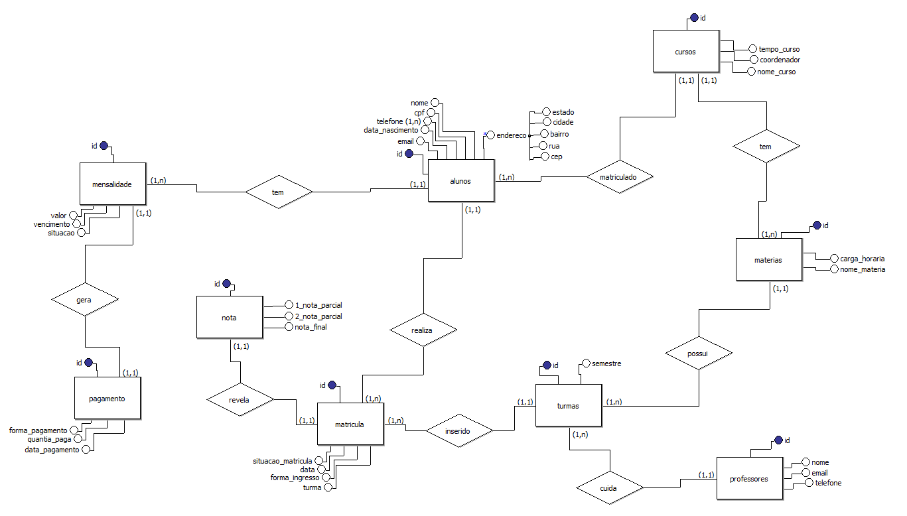

# 🎓 Sistema de Gerenciamento Acadêmico

Olá! Esse projeto foi feito como parte do curso de Análise e Desenvolvimento de Sistemas – UNIFECAF.  
Criei um sistema acadêmico simples e funcional, que gerencia alunos, cursos, notas, mensalidades, professores e muito mais.

Usei o MySQL Workbench para modelar tudo certinho!

---

## 🧠 Modelo Conceitual (DER)

Comecei com o Diagrama Entidade-Relacionamento (DER).  
Ele mostra como tudo se conecta: alunos, cursos, notas, pagamentos... é como o mapa do sistema!

Exemplos:
- Um aluno pode ter várias mensalidades.
- Cada matrícula gera notas.
- Matérias pertencem a um curso.

---

## 🔄 Modelo Lógico

Depois do conceitual, vem o modelo lógico, que define os nomes das tabelas, os tipos de relacionamentos (1:N, N:N) e prepara tudo para virar tabelas de verdade.

Esse modelo mostra como as entidades do DER viram estruturas com nomes de tabelas e chaves estrangeiras.

---

## 🛠 Modelo Físico (Banco de Dados)

Com base no modelo lógico, construí o banco no MySQL Workbench.  
Aqui já temos os nomes das tabelas, campos, tipos de dados e relacionamentos prontos para execução.

---

## 📋 Entidades do Sistema

Essas são as principais partes do sistema:

- 👤 Alunos – Dados pessoais e curso.  
- 🏠 Endereço – Ligado ao aluno.  
- 🎓 Cursos – Nome, tempo e coordenador.  
- 📚 Matérias – Carga horária e nome.  
- 🏫 Salas – Onde as aulas acontecem.  
- 👨‍🏫 Professores – Nome, e-mail e telefone.  
- 📝 Matrícula – Dados de entrada e turma.  
- 💸 Mensalidades – Valor, vencimento e status.  
- ✅ Pagamentos – Forma, valor e data.  
- 📊 Notas – Avaliações do aluno.  

---

## 💻 Tecnologias Utilizadas

- MySQL Workbench  
- SQL  
- Git & GitHub  

---

## 📄 Licença

Este projeto está sob a licença MIT. Veja o arquivo [LICENSE](LICENSE) para mais detalhes.

---

Feito com dedicação por [Kevin Soares](https://github.com/KevinSoaresFC)
